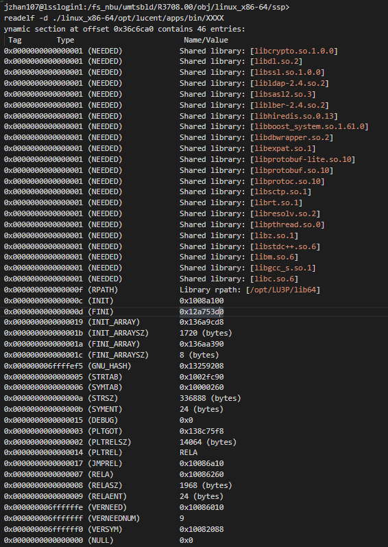

# 1. Reference Link

[Linux系统中“动态库”和“静态库”那点事儿](http://blog.jobbole.com/107977/)

[Linux如何解决动态库的版本控制](https://my.oschina.net/qyh/blog/54672)

[LINUX总结第13篇：LINUX下动态库及版本号控制](https://blog.csdn.net/alspwx/article/details/36655645)

[Linux程序编译链接动态库版本的问题](https://blog.csdn.net/littlewhite1989/article/details/47726011)

[linux共享库的版本控制和使用](http://lovewubo.github.io/shared_library)

[Linux下Gcc生成和使用静态库和动态库详解](http://www.cppblog.com/deane/articles/165216.html)

# 2. Terminology

    ELF - 在Linux操作系统中，普遍使用ELF格式作为可执行程序或者程序生成过程中的中间格式。ELF（Executable and Linking Format，可执行连接格式）是UNIX系统实验室（USL）作为应用程序二进制接口（Application BinaryInterface，ABI）而开发和发布的。

    Shared Library  -
        soname      - 别名(Short for shared object name)    - libtest.so.0
        realname    - 真名(realname)                        - libcrypto.so.0.0.1
        linker name - 链接名(linker name)                   - libtest.so 

# 3. Interpretation

##  ELF文件格式包括三种主要的类型：可执行文件、可重定向文件、共享库。

    1．可执行文件（应用程序）

    可执行文件包含了代码和数据，是可以直接运行的程序。

    2．可重定向文件（*.o）

    可重定向文件又称为目标文件，它包含了代码和数据（这些数据是和其他重定位文件和共享的object文件一起连接时使用的）。

    *.o文件参与程序的连接（创建一个程序）和程序的执行（运行一个程序），它提供了一个方便有效的方法来用并行的视角看待文件的内容，这些*.o文件的活动可以反映出不同的需要。

    3．共享文件（*.so）

    动态库文件，它包含了代码和数据（这些数据是在连接时候被连接器ld和运行时动态连接器使用的）。

    一个ELF文件从连接器（Linker）的角度看，是一些节的集合；从程序加载器（Loader）的角度看，它是一些段（Segments）的集合。ELF格式的程序和共享库具有相同的结构，只是段的集合和节的集合上有些不同。

##  Shared Library
    realname    - 第一个是共享库本身的文件名（real name），其通常包含版本号，常常是是这样： libmath.so.1.1.1234 。 lib是Linux 上的库的约定前缀，math 是共享库名字，so 是共享库的后缀名，1.1.1234的是共享库的版本号，其主版本号+小版本号+build号。主版本号，代表当前动态库的版本，如果动态库的接口有变化，那么这个版本号就要加1；后面的两个版本号（小版本号 和 build 号）是告诉你详细的信息，比如为一个hot-fix 而生成的一个版本，其小版本号加1，build号也应有变化。 这个文件名包含共享库的代码。

    soname      - 其是应用程序加载dll 时候，其寻找共享库用的文件名。 don't care of “minor build version or build version” when no API update.
        lib + math+.so + ( major version number)

    link name   - 顾名思义，就是在编译过程，link 阶段用的文件名。 其将sonmae 和real name 关联起来。其是不带任何版本信息的。在共享库编译过程中，连接（link） 阶段，编译器将生成一个共享库及real name，同时将共享库的soname，写在共享库文件里的文件头里面。可以用命令 readelf -d sharelibrary 去查看。
        lib + math +.so

    ldconifg    - Linux 系统提供一个命令 ldconifg 专门为生成共享库的soname 文件，以便程序在加载时后通过soname 找到共享库。 同时该命令也为加速加载共享库，把系统的共享库放到一个缓存文件中，这样可以提高查找速度。可以用下面命令看一下系统已有的被缓存起来的共享库.

### 共享库，小版本升级，即接口不变.

    当升级小版本时，共享库的soname 是不变的，所以需要重新把soname 的那个连接文件指定新版本就可以。 调用ldconfig命令，系统会修改那个soname link文件，并把它指向新的版本呢。这时候应用程序就自动升级了。

### 共享库，主版本升级，即接口发生变化。

    当升级主版本时，共享库的soname 就会加1。比如libhello.so.0.0.0 变为 libhello.so.1.0.0. 这时候再运行ldconfig 文件，就会发现生成两个连接文件。

    ln -s libhello.so.0---->libhello.so.0.0.0

    ln -s libhello.so.1----->libhello.so.1.0.0

    尽管共享库升级，但是你的程序依旧用的是旧的共享库，并且两个之间不会相互影响。

    问题是如果更新的共享库只是增加一些接口，并没有修改已有的接口，也就是向前兼容。但是这时候它的主版本号却增加1. 如果你的应用程序想调用新的共享库，该怎么办？ 简单，只要手工把soname 文件修改，使其指向新的版本就可以。（这时候ldconfig 文件不会帮你做这样的事，因为这时候soname 和real name 的版本号主板本号不一致，只能手动修改）

    比如： ln -s libhello.so.0 ---> libhello.so.1.0.0

    但是有时候，主版本号增加，接口发生变化，可能向前不兼容。这时候再这样子修改，就会报错，“xx”方法找不到之类的错误。

### Linux 系统是通过共享库的三个不同名字，来管理共享库的多个版本。 
    
    real name 就是共享库的实际文件名字，soname 就是共享库加载时的用的文件名。在生成共享库的时候，编译器将soname 绑定到共享库的文件头里，二者关联起来。 在应用程序引用共享库时，其通过link name 来完成，link时将按照系统指定的目录去搜索link名字找到共享库，并将共享库的soname写在应用程序的头文件里。当应用程序加载共享库时，就会通过soname在系统指定的目录（path or LD_LIBRARY)去寻找共享库。

    当共享库升级时，分为两种。一种是主板本不变，升级小版本和build 号。在这种情况下，系统会通过更新soname（ ldconfig 来维护），来使用新的版本号。这中情况下，旧版本就没有用，可以删掉。

    另外一种是主版本升级，其意味着库的接口发生变化，当然，这时候不能覆盖已有的soname。系统通过增加一个soname（ldconfig -p 里面增加一项），使得新旧版本同时存在。原有的应用程序在加载时,还是根据自己头文件的旧soname 去寻找老的库文件。

    5.如果编译的时候没有指定，共享库的soname，会怎么样？

    这是一个trick 的地方。第一系统将会在生成库的时候，就没有soname放到库的头里面。从而应用程序连接时候，就把linkname 放到应用程序依赖库里面。或者换句话说就是，soname这时候不带版本号。 有时候有人直接利用这点来升级应用程序，比如，新版本的库，直接拷贝到系统目录下，就会覆盖掉已经存在的旧的库文件，直接升级。 这个 给程序员很大程度的便利性，如果一不小心，就会调到类似windows的Dll hell 陷阱里面。建议不要这样做。

# 4.  ldconfig

    为了使得动态链接库可以被系统使用，当我们修改了/etc/ld.so.conf或/etc/ld.so.conf.d/目录下的任何文件，或者往那些目录下拷贝了新的动态链接库文件时，都需要运行一个很重要的命令：ldconfig，该命令位于/sbin目录下，主要的用途就是负责搜索/lib和/usr/lib，以及配置文件/etc/ld.so.conf里所列的目录下搜索可用的动态链接库文件，然后创建处动态加载程序/lib/ld-linux.so.2所需要的连接和(默认)缓存文件/etc/ld.so.cache(此文件里保存着已经排好序的动态链接库名字列表)。

# 5. Practice

    <qa24a-s00c11h0:root>/etc:
    # vi ld.so.conf
        |
        +---include ld.so.conf.d/*.conf

    ld.so.cache

##  gcc Compiler options

### PIC - position independent code

    -fPIC 作用于编译阶段，告诉编译器产生与位置无关代码(Position-Independent Code)，则产生的代码中，没有绝对地址，全部使用相对地址，故而代码可以被加载器加载到内存的任意位置，都可以正确的执行。这正是共享库所要求的，共享库被加载时，在内存的位置不是固定的.
    如果不加-fPIC,则加载.so文件的代码段时,代码段引用的数据对象需要重定位, 重定位会修改代码段的内容,这就造成每个使用这个.so文件代码段的进程在内核里都会生成这个.so文件代码段的copy.每个copy都不一样,取决于 这个.so文件代码段和数据段内存映射的位置.
    Refer to for more: 
[gcc编译参数-fPIC的一些问题](http://blog.sina.com.cn/s/blog_54f82cc201011op1.html)

### -W -w -Wall
    -w的意思是关闭编译时的警告，也就是编译后不显示任何warning，因为有时在编译之后编译器会显示一些例如数据转换之类的警告，这些警告是我们平时可以忽略的。
    -Wall选项意思是编译后显示所有警告。
    -W选项类似-Wall，会显示警告，但是只显示编译器认为会出现错误的警告。
    在编译一些项目的时候可以-W和-Wall选项一起使用。

### -l
    -l参数就是用来指定程序要链接的库，-l参数紧接着就是库名

### -L    添加链接库的搜索路径

##  A) . /jerry/learn/test
    
    main.c add.c sub.c tiger.h
    |
    +---gcc -fpic  -c  add.c
        gcc -fpic  -c  sub.c
    |
    +---gcc -shared -o libtiger.so add.o sub.o        
        / gcc -fpic -shared add.c sub.c -o libtiger.so

    |
    +---gcc -o  main  main.c -L  ./  -ltiger
    ./main
        ./main: error while loading shared libraries: libtiger.so: cannot open shared object file: No such file or directory
        |
        +---ldconfig `pwd`       /     export LD_LIBRARY_PATH=`pwd`:$LD_LIBRARY_PATH

            after running ldconfig `pwd`, you could find the libtiger.h in /etc/ld.so.cache
            after rerun ldconfig, it the cache file will be rebuilt, and no /jerry/learn/test/libtiger.so was cached in the cache file.

    export will not rebuild the /etc/ld.so.cache

##  B) . /jerry/learn/hello
    hello.c  hello.h  main.c

    1.生成共享库，关联real name 和soname
    gcc -g -Wall -fPIC -c hello.c -o hello.o
    gcc -shared -Wl,-soname=libhello.so.0 -o libhello.so.0.0.0 hello.o
    gcc -shared -Wl,-soname,libhello.so.0 -o libhello.so.0.0.0 hello.o
        |
        (-Wl,-soname -Wl 告诉编译器将后面的参数传递到连接器。而 -soname 指定了共享库的soname.如果我们没有设置它的soname,则默认为该共享库的文件名 )
        ( 执行ldconfig -vn . (有点)，在当前目录县生成soname链接到 libhello.so.0.0.0)

    root@49efe8bedaf4:/jerry/learn/hello# readelf -d libhello.so.0.0.0 | grep libhello
    0x000000000000000e (SONAME)             Library soname: [libhello.so.0]
    (gcc main.c -o main -Wl,-rpath=./ -L. -lhello)

    2. 应用程序，引用共享库
    ln -s libhello.so.0.0.0 libhello.so.0
    ln -s libhello.so.0 libhello.so
    
    gcc -g -Wall -c main.c -o main.o -I.
    gcc  -o main main.o -lhello -L.
            (指定版本gcc main.c libhello.so.0 -L./ -Wl,-rpath=./ -o main)

    readelf -d main | grep libhello

    或者：
    gcc hello.c -fPIC -shared -Wl,-soname,libhello.so.0 -o libhello.so.0.0.1
    +
    root@49efe8bedaf4:/jerry/learn/hello# ls
    hello.c  hello.h  libhello.so.0.0.1  main  main.c
    +
    root@49efe8bedaf4:/jerry/learn/hello# ldconfig -n . 
    root@49efe8bedaf4:/jerry/learn/hello# ls
    hello.c  hello.h  libhello.so.0  libhello.so.0.0.1  main  main.c
        | 
        +---这个软链接是如何生成的呢，并不是截取libhello.so.0.0.1名字的前面部分，而是根据libhello.so.0.0.1编译时指定的-soname生成的。也就是说我们在编译动态库时通过-soname指定的名字，已经记载到了动态库的二进制数据里面。不管程序是否按libxxx.so.a.b.c格式命名，但Linux上几乎所有动态库在编译时都指定了-soname
    +
    root@49efe8bedaf4:/jerry/learn/hello# gcc main.c -L. -lhello -o main
    /usr/bin/ld: cannot find -lhello
    collect2: error: ld returned 1 exit status
    + 
    ln -s libhello.so.0 libhello.so
    +
    gcc main.c -L. -lhello -o main
    +
    root@49efe8bedaf4:/jerry/learn/hello# gcc main.c -L. -lhello -o main
    root@49efe8bedaf4:/jerry/learn/hello# ls -l
    total 32
    -rw-r--r-- 1 root root   84 Dec  6 08:33 hello.c
    -rw-r--r-- 1 root root   69 Dec  6 08:32 hello.h
    lrwxrwxrwx 1 root root   13 Dec 10 07:11 libhello.so -> libhello.so.0
    lrwxrwxrwx 1 root root   17 Dec 10 07:07 libhello.so.0 -> libhello.so.0.0.1
    -rwxr-xr-x 1 root root 7904 Dec 10 07:06 libhello.so.0.0.1
    -rwxr-xr-x 1 root root 8288 Dec 10 07:12 main
    -rw-r--r-- 1 root root   73 Dec  6 08:34 main.c
    +
    root@49efe8bedaf4:/jerry/learn/hello# ldd main
    linux-vdso.so.1 (0x00007ffdb1bfe000)
    libhello.so.0 (0x00007f528eed4000)
    libc.so.6 => /lib/x86_64-linux-gnu/libc.so.6 (0x00007f528eadc000)
    /lib64/ld-linux-x86-64.so.2 (0x00007f528f2e4000)
    +
## 总结：在生成main程序的过程有如下几步:

  1. 链接器通过编译命令-L. -lhello在当前目录查找libhello.so文件
  2. 读取libhello.so链接指向的实际文件，这里是libhello.so.0.0.1
  3. 读取libhello.so.0.0.1中的SONAME，这里是libhello.so.0
  4. 将libhello.so.0记录到main程序的二进制数据里

# Note

  1. 指定共享库加载的路径。LD_LIBRARY_PATH 优先于 path 环境变量。

  2. ldd 可以查看程序，或者共享库依赖的库的路径

  3. nm 查看共享库暴露的接口

  4. ldconfig 可以自动生成soname 的连接文件。并提供catch 加速查找。

  5. readelf 可以查看动态库的信息，比如依赖的库，本身的soname。

  6. objdump 与readelf 类似。

  7. ld The GUN linker

  8. ld.so  dynamic linker or loader

  9. as the portable GNU assembley

  10. libc.so.6 是c运行时库glibc的软链接，而系统几乎所有程序都依赖c运行时库。程序启动和运行时，是根据libc.so.6 软链接找到glibc库。

# Q & A

1. why soname?

    这个soname的存在是为了兼容方便。 

    比如： 
    有一个程序ap1,以及一个库libtest.so.1 
    ap1启动的时候需要libtest.so.1 
    如果链接的时候直接把libtest.so.1传给了ap1，那么将来库升级为libtest.so.2的时候，ap1仍然只能使用 libtest.so.1的代码，并不能得到升级的好处。而如果指定了soname为libtest.so,那么ap1启动的时候将查找的就是 libtest.so而不是其在被链接时实际使用的库libtest.so.1这个文件名。 
    在开始时我们建立一个链接:ln -sf libtest.so.1 libtest.so 
    而在库升级后，我们重新：ln -sf libtest.so.2 libtest.so即可，这样ap1不需要任何变动就能享受升级后的库的特性了。而libtest.so.1,libtest.so.2可以同时存在于系统内，不必非得把libtest.so.2的名字改成libtest.so.1
   
    严格遵守上述规定，确实能避免动态库因为版本冲突的问题，但是读者可能有疑问：在程序加载或运行的时候，动态链接器是如何知道程序依赖哪些库，如何选择库的不同版本？
    Solaris和Linux等采用SO-NAME( Shortfor shared object name )的命名机制来记录共享库的依赖关系。每个共享库都有一个对应的“SO-NAME”(共享库文件名去掉次版本号和发布版本号)。比如一个共享库名为libtest.so.3.8.2,那么它的SO-NAME就是libtest.so.3。

    在Linux系统中，系统会为每个共享库所在的目录创建一个跟SO-NAME相同的并且指向它的软连接(Symbol Link)。这个软连接会指向目录中主版本号相同、次版本号和发布版本号 最新的共享库。也就是说，比如目录中有两个共享库版本分别为：/lib/libtest.so.3.8.2和/lib/libtest.so.3.7.5,么软连接/lib/libtest.so.3指向 /lib/libtest.so.3.8.2。

    建立以SO-NAME为名字的软连接的目的是，使得所有依赖某个共享库的模块，在编译、链接和运行时，都使用共享库的SO-NAME，而不需要使用详细版本号。在编译生产ELF文件时候，如果文件A依赖于文件B，那么A的链接文件中的”.dynamic”段中会有DT_NEED类型的字段，字段的值就是B的SO-NAME。这样当动态链接器进行共享库依赖文件查找时，就会依   据系统中各种共享库目录中的SO-NAME软连接自动定向到最新兼容版本的共享库。

    ★  readelf -d sharelibrary 可以查看so-name
    ★  Linux提供了一个工具——ldconfig，当系统中安装或更新一个共享库时，需要运行这个工具，它会遍历默认所有共享库目录，比如/lib，/usr/lib等，然后更新所有的软链接，使她们指向最新共享库。

2. 如果采用带版本号的库,例如libhello.so.2

    链接命令可使用g++ main.cpp libhello.so.2 -L./ -Wl,-rpath=./ -o main

3. 为什么这里ldd查看main显示libhello.so.0为not found呢，
    
    因为ldd是从环境变量$LD_LIBRARY_PATH指定的路径里来查找文件的

4.  libtest.so.0是not found的状态。
    
    为什么呢？因为这个库的当前所在路径并不在链接程序（ld.so)的搜索路径之中，所以无法找到。如何解决？几个方案：

    a. 改变LD_LIBRARY_PATH

    export LD_LIBRARY_PATH=/home/bow/all/program/test/lib_version_test:$LD_LIBRARY_PATH

    这里/home/bow/all/program/test/lib_version_test是共享库的路径。虽然改变LD_LIBRARY_PATH能达到目的，但是不推荐使用，因为这是一个全局的变量，其他应用程序可能受此影响，导致各种库的覆盖问题。
    如果要清除这个全局变量，使用命令unset LD_LIBRARY_PATH

    b. 用rpath

    在编译应用程序时，利用rpath指定加载路径。 gcc -L. -Wl,-rpath=/home/bow/all/program/test/lib_version_test -o test main.o -ltest 这样，虽然避免了各种路径找不到的问题，但是也失去了灵活性。因为库的路径被定死了。

    c. 改变ld.so.conf

    将路径添加到此文件，然后使用ldconfig更新加载程序的cache。 可以使用命令ldconfig -p查看当前所有库的soname->real name的对应关系信息

5. 应用程序在编译链接和运行加载时，库的搜索路径的先后顺序。

##### 编译链接时，查找顺序
    
    /usr/local/lib
    /usr/lib
    用-L指定的路径，按命令行里面的顺序依次查找

##### 运行加载时的顺序
    
    可执行程序指定的的DT_RPATH
    LD_LIBRARY_PATH. 但是如果使用了setuid/setgid，由于安全因素，此路径将被忽略.
    可执行程序指定的的DT_RUNPATH. 但是如果使用了setuid/setgid，由于安全因素，此路径将被忽略
    /etc/ld/so/cache. 如果链接时指定了‘-z nodeflib’，此路径将被忽略.
    /lib. 如果链接时指定了‘-z nodeflib’，此路径将被忽略
    /usr/lib. 如果链接时指定了‘-z nodeflib’，此路径将被忽略
   
##### 静态库链接时搜索路径顺序
    
    ld会去找GCC命令行中的参数-L的目录中是否有该静态库；
    再去找GCC的环境变量LIBRARY_PATH
    再找内定目录/lib、/usr/lib、/usr/local/lib夏是否有该链接库，这是当初compile gcc的时候确定的

##### 动态库链接时、执行时搜索路径顺序
   
    编译目标代码时指定的动态库搜索路径；
    环境变量LD_LIBRARY_PATH指定的动态库搜索路径；
    配置文件/etc/ld.so.conf中指定的动态库搜索路径；
    默认的动态搜索路径/lib;
    默认的动态库搜索路径/usr/lib

# pkg-config

[pkg-config的一些用法](https://blog.csdn.net/luotuo44/article/details/24836901)

    /home_nbu/jzhan107/projects/09/obj/linux_x86
    vi ./sde/opt/LU3P/lib/pkgconfig
    " ============================================================================
    " Netrw Directory Listing                                        (netrw v132)
    "   /home_nbu/jzhan107/projects/09/obj/linux_x86/sde/opt/LU3P/lib/pkgconfig
    "   Sorted by      name
    "   Sort sequence: [\/]$,\.h$,\.c$,\.cpp$,*,\.o$,\.obj$,\.info$,\.swp$,\.bak$,\~$
    "   Quick Help: <F1>:help  -:go up dir  D:delete  R:rename  s:sort-by  x:exec
    " ============================================================================
    ../
    libcrypto.pc@
    libcurl.pc@
    libssl.pc@
    openssl.pc@
    xmlsec1-openssl.pc@
    xmlsec1.pc@

    jzhan107@lsslogin1:/home_nbu/jzhan107/projects/08test/obj/linux_x86/sde/tpp/openssl/linux_x86/openssl-1.1.1>
    $ pkg-config --cflags --libs openssl
    sh: gnome-config: not found
    Package openssl was not found in the pkg-config search path.
    Perhaps you should add the directory containing `openssl.pc'
    to the PKG_CONFIG_PATH environment variable
    No package 'openssl' found

    jzhan107@lsslogin1:/home_nbu/jzhan107/projects/08test/obj/linux_x86/sde/tpp/openssl/linux_x86/openssl-1.1.1>
    $ export PKG_CONFIG_PATH=/home_nbu/jzhan107/projects/08test/obj/linux_x86/sde/tpp/openssl/linux_x86/openssl-1.1.1;pkg-config --cflags --libs openssl
    -I/opt/LU3P/include  -L/opt/LU3P/lib -lssl -lcrypto

# Comiler Order

## Reference for Compiler Order

[linux中动态链接库的搜索顺序](http://blog.sina.com.cn/s/blog_5ac88b350100bdd8.html)

1. in our system build directory, we can not run ldd 
    
    jzhan107@lsslogin1:/fs_nbu/umtsbld/R3708.00/obj/linux_x86-64/ssp>
    $ ldd ./linux_x86-64/opt/lucent/apps/bin/ngss
    ldd: ./linux_x86-64/opt/lucent/apps/bin/ngss: ELF machine type: EM_AMD64: is incompatible with system

2. try readelf -d 
    
   

3. Linux系统下连接器ld链接顺序的总结

  + 库的加载顺序是按顺序进行的，从左到右，优先级最高

  + 可以使用nm和readelf、ldd等命令来查看你的库的依赖和符号表以及导出的函数符号等

  + 如果有多个库，使用了相同的函数名或者类名，结构体名称会怎么样？
    
    
